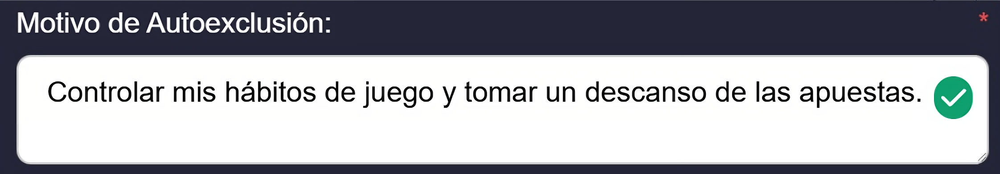

# Autoexclusión.

Al ingresar a la sección de [**Autoexclusión**](https://app.gitbook.com/o/QcwavWzh0dfIwPyknoIT/s/mbqa0WvDWam8G20QQoIZ/~/changes/21/#autoexclusion), encontrarás la siguiente interfaz:

<figure><figcaption>
Figura #1: Captura de pantalla sección autoexclusión.
</figcaption></figure>

&#x20;En la parte superior, verás una descripción que detalla en qué consiste la [autoexclusión](https://app.gitbook.com/o/QcwavWzh0dfIwPyknoIT/s/mbqa0WvDWam8G20QQoIZ/~/changes/21/#autoexclusion).

<figure><figcaption>
Figura #2: Captura de pantalla texto informativo.
</figcaption></figure>

Debajo de este texto explicativo, encontrarás varias opciones para configurar la autoexclusión:

<figure><figcaption>
Figura #3: Captura de pantalla campos para hacer autoexclusión.
</figcaption></figure>

Las opciones disponibles son las siguientes:

* **Tipo**: En este menú desplegable, selecciona la categoría o línea de producto de la que deseas autoexcluirte. Las opciones disponibles son:
  * **Sportsbook:** Se refiere a la sección de apuestas deportivas.
  * **Virtual Sport:** Esta sección incluye apuestas en eventos deportivos simulados digitalmente.
  * **Casino:** Corresponde a los juegos de casino en línea, como tragamonedas (slots), ruleta, blackjack, y otros juegos de azar.
  * **Live Casino:** En esta sección, el usuario puede jugar en mesas de casino en vivo, con crupieres reales y transmisión en tiempo real.&#x20;

Después de elegir la [vertical](https://app.gitbook.com/o/QcwavWzh0dfIwPyknoIT/s/mbqa0WvDWam8G20QQoIZ/#vertical) a excluir, deberás definir el tiempo durante el cual deseas mantener esta exclusión activa.

* **Fecha Límite de Autoexclusión**: Selecciona el período durante el cual deseas aplicar la autoexclusión. Las opciones disponibles son:
  * **1 día:** Exclusión por 24 horas.
  * **1 semana**: Exclusión por siete días.
  * **1 mes**: Exclusión por treinta días.
  * **3 meses**: Exclusión por tres meses.
  * **6 meses**: Exclusión por seis meses.
  * **1 año**: Exclusión por un año.


**Nota**: Selecciona cuidadosamente el período de [autoexclusión](https://app.gitbook.com/o/QcwavWzh0dfIwPyknoIT/s/mbqa0WvDWam8G20QQoIZ/~/changes/21/#autoexclusion), ya que, una vez activado, no podrá ser revertido hasta que hayan transcurrido al menos 24 horas.


**Motivo de Autoexclusión**:&#x20;

Este campo es obligatorio y en él debes especificar el motivo de tu autoexclusión. Puedes incluir razones como, por ejemplo:

<figure><figcaption>
Figura #4: Captura de pantalla motivo de autoexclusión.
</figcaption></figure>

Una vez que hayas completado todos los campos necesarios, debes hacer clic en el botón "**Guardar**", ubicado en la parte inferior de la página, para asegurarte de que todos los cambios se almacenen correctamente.

En la parte inferior de la página se encuentra una tabla que muestra la siguiente información organizada en columnas:

* **ID**: Esta columna contiene el identificador único de cada exclusión.
* **Anular**: En esta columna se encuentra un botón que permite anular la exclusión. Es importante tener en cuenta que este botón solo estará disponible después de que hayan transcurrido 24 horas desde la acción inicial.
* **Tipo**: Aquí se indica el tipo de [vertical](https://app.gitbook.com/o/QcwavWzh0dfIwPyknoIT/s/mbqa0WvDWam8G20QQoIZ/#vertical) en la que se aplicó la autoexclusión.
* **Fecha de Creación**: En esta columna se muestra la fecha en que se creo la autoexclusión.
* **Fecha de Finalización**: Muestra la fecha en la que se completó o finalizó la autoexclusión.
* **Estado**: Esta columna muestra el estado actual de la autoexclusión. Los posibles estados son:
  * **Activo**: La autoexclusión está en vigor, lo que significa que la [vertical](https://app.gitbook.com/o/QcwavWzh0dfIwPyknoIT/s/mbqa0WvDWam8G20QQoIZ/#vertical) está excluida y  no podrás acceder a ella durante el período establecido o hasta cancelarla.
  * **Inactivo**: La autoexclusión ha expirado o ha sido desactivada, por lo que el usuario ya puede acceder nuevamente a la [vertical](https://app.gitbook.com/o/QcwavWzh0dfIwPyknoIT/s/mbqa0WvDWam8G20QQoIZ/#vertical) excluida.
  * **Cancelado**: La autoexclusión ha sido cancelada antes de su expiración.
