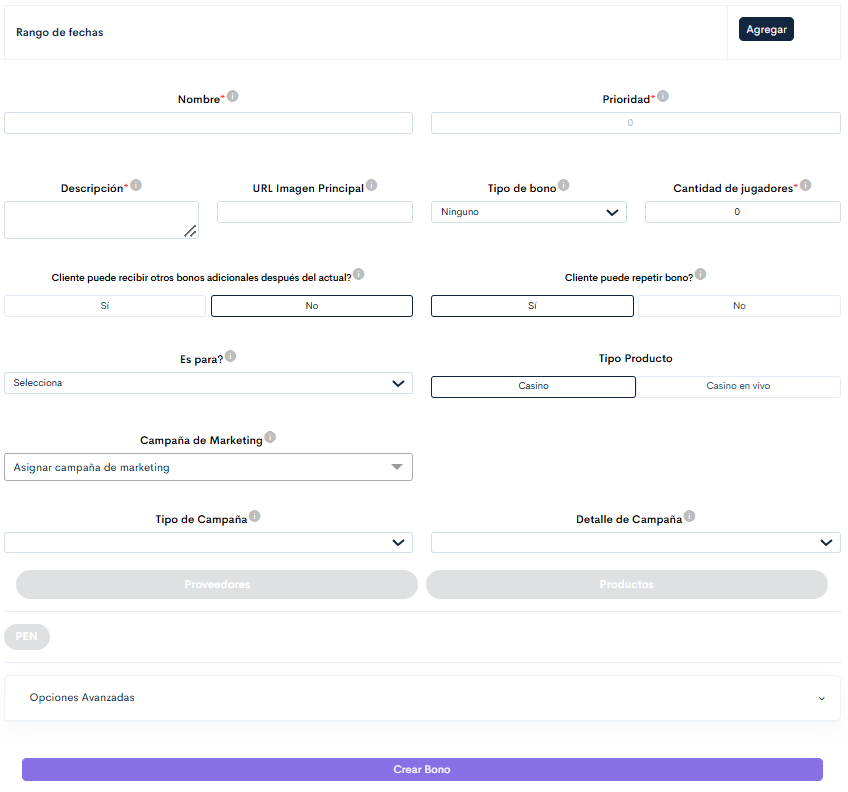

# Merkur.

Esta es la visual completa del Bono FreeSpin

<figure><figcaption>
Figura #1: Captura de pantalla de la sección FreeSpin.
</figcaption></figure>

En este caso nos céntratenos solo en las configuraciones necesarias para la configuración de los nuevos juegos integrados por el proveedor Merkur.

* **Rango de fechas:** El botón **"Agregar"**, desplegará una opción que te permitirá configurar las fechas durante las cuales el bono estará activo. Aquí deberás seleccionar tanto la **fecha inicial** como la **fecha final** para definir el período de vigencia del bono.
* **Botón proveedores:** Este botón Desplegará un listado solo con los proveedores que tienen el Bonus System activo, en este caso se debe visualizar y seleccionar la opción "**Merkur"**.
* **Botón Productos:** Este botón despegará 2 listas para seleccionar un juego dependiendo el proveedor, en este caso, es necesario volver a seleccionar el proveedor "**Merkur**", para visualizar los juegos disponibles.


**Nota**: Al configurar los campos "**Proveedores**" y "**Productos**" se desplegará una tabla en la cual debes especificar el porcentaje del bono que asumirá el proveedor.


*   **Moneda**: Para poder dar uso a los bonos FreeSpin con el proveedor Merkur, es necesario seleccionar la moneda del país con el que estamos generando el bono, esto activará las siguientes configuraciones.

    * **Valor por ronda:** Este es el monto que tendrá el bono por cada ronda jugada. Al configurar esta opción, es crucial verificar previamente el monto de apuesta permitido en los juegos seleccionados, ya que este debe coincidir exactamente con el valor ingresado en este campo.
    * **Rondas gratuitas:** En este campo podrás ingresar la cantidad de rondas gratuitas que el usuario podrá jugar con este bono.
    * **Jugadores:** En esta configuración, se debe ingresar el ID de cada usuario que tendrá el bono activo. Este proceso requiere cargar un archivo en formato **CSV** con los ID´s correspondientes. El sistema tomará los datos del archivo y activará automáticamente el bono para los jugadores especificados.

    
    **Ejemplo:** Si ingresamos un valor de 10 en el campo "**Valor por ronda**", pero el juego tiene una apuesta máxima permitida de 5, el bono no funcionará porque los valores no coinciden.
    

Estas son las configuraciones principales y necesarias para generar un bono FreeSpin con los juegos del proveedor Merkur, en caso de necesitar información más detallada sobre cómo crear el bono FreeSpin, puedes acceder a la siguiente página:


[https://app.gitbook.com/s/rLdGx9JdTz3uLoquKvJw/torneos-y-bonos./como-acceder-a-la-plataforma-./crear-eventos./crear-bono./freespin.](https://app.gitbook.com/s/rLdGx9JdTz3uLoquKvJw/torneos-y-bonos./como-acceder-a-la-plataforma-./crear-eventos./crear-bono./freespin.)


## Merkur en plataforma:

Realizaremos el ejemplo desde la plataforma Doradobet desde la siguiente ruta:&#x20;

* **Menú/ Casino/ Merkur.**

Al seguir esta ruta podrás filtrar solo los juegos disponibles por el proveedor Merkur.

<figure><figcaption>
Figura #2: Captura de pantalla filtro proveedores.
</figcaption></figure>


**Nota:** Si ocurre un error durante la ejecución del juego, se mostrará un mensaje emergente (pop-up) informando sobre el problema, y el sistema te redireccionará al lobby.

